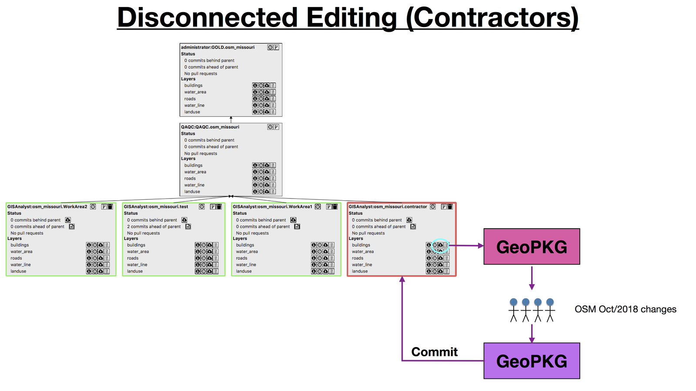
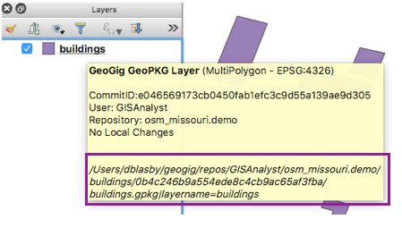
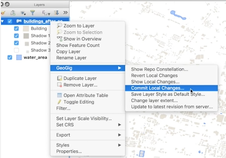

Disconnected Editing
====================

.. raw:: html

    <iframe src="https://player.vimeo.com/video/296739298?title=0&byline=0&portrait=0" width="640" height="360" frameborder="0" webkitallowfullscreen mozallowfullscreen allowfullscreen></iframe>
    
<a href="https://vimeo.com/295261790">GeoGig WebAPI - Disconnected Editing Workflow</a>
 
    
    

Disconnected editing is editing a GeoGig layer when you are not connected to GeoGig (or are using tools that aren't GeoGig aware).  The typical situation for disconnected editing is contractors editing layers while not connected to (or aware of) GeoGig. 

The GeoGig GeoPackage tracks changes made to it.  When you re-integrate the GeoPackage with GeoGig, you can commit those changes to the repository. 

The basic process is to download data from GeoGig to a GeoPackage, send the GeoPackage to the contractor to modify, then commit the changes back to GeoGig.

   Outline of the disconnected editing example in the video

Disconnected Editing Process
----------------------------

1. Create a repository to hold your contractor's changes ("fork")
2. Download a GeoPackage for the layer to be edited (either the entire dataset or a sub-extent).
3. Find the location of the GeoPackage on your file-system. You can do that by hovering over the layer in the QGIS :guilabel:`Layers` panel (see figure below). The folder into which GeoGig GeoPackage.layers are stored can be configured in the `GeoGig settings <settingsconf.html>`_.
4. Quit QGIS (so its not connected to the GeoPackage anymore).
5. Send the GeoPackage to your contractor (or edit with non-QGIS tools).

   * NOTE: the contractor should only use the main layer (i.e. "buildings", not any of the meta-datasets that start with "geogig.").

6. When the contractor is finished, re-start QGIS (with the GeoGig Plugin).
7. Add the GeoPackage the contractor returned to QGIS (:guilabel:`Layer -> Add Layer -> Add Vector Layer...`).
8. GeoGig will notice this is a GeoGig layer and re-integrate it (you will likely have to logon to the GeoGig Server).
9. Right-Click on the GeoPackage layer in QGIS :guilabel:`Layers` panel and choose :guilabel:`GeoGig -> Commit Local Changes...`
10. Give a commit message for this commit.
11. Wait for the changes to be moved to the server (and the GeoPackage updated with changes from the server) - this can take some time.
12. Once the changes are committed, use the :guilabel:`Constellation Viewer` to move the changes through the Workflow.

NOTE: do not modify the contractor's repository outside of the steps above

   Hover over a GeoPackage layer to find it's location on your computer

   Commit the contractor's changes to their repository