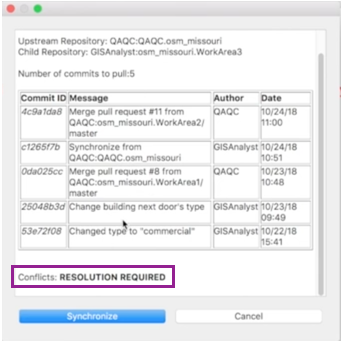
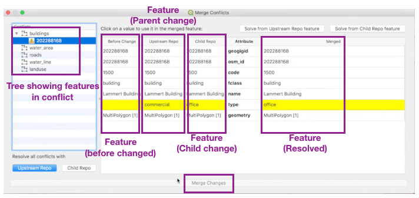
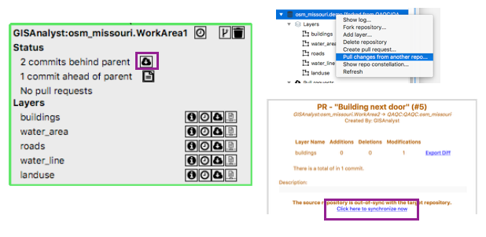
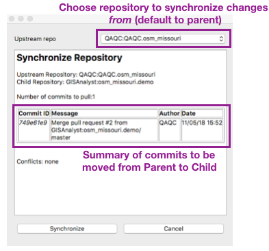
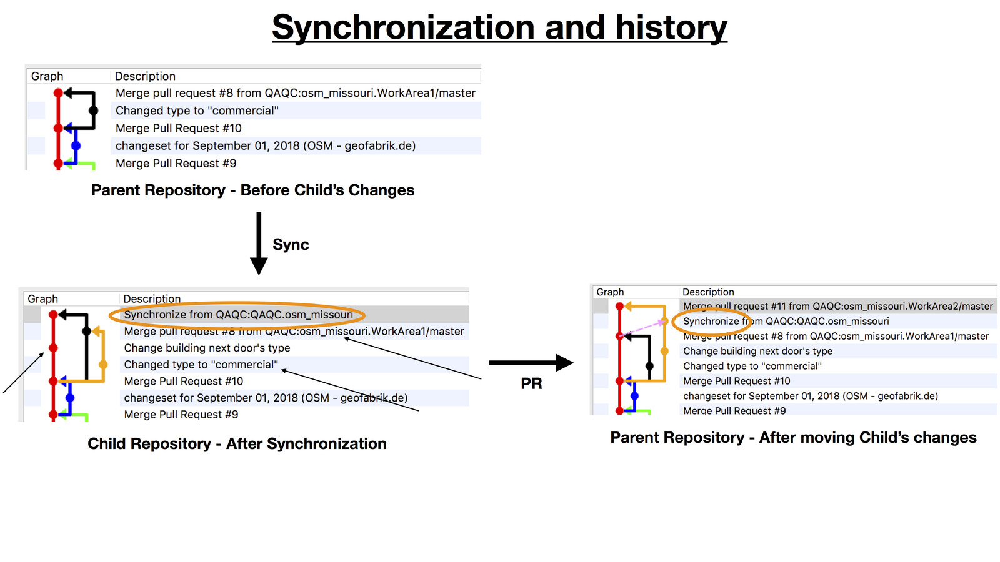

Synchronization
===============

.. raw:: html

    <iframe src="https://player.vimeo.com/video/296981752?title=0&byline=0&portrait=0" width="640" height="360" frameborder="0" webkitallowfullscreen mozallowfullscreen allowfullscreen></iframe>
    
<a href="https://vimeo.com/295261790">GeoGig WebAPI - Synchronization</a>
 
    
    

The Synchronization video goes through, in detail, about Synchronization (including conflict resolution and interpreting history).  Please view it for more details.

Synchronization is similar to a Pull Request - it's moving changes between repositories.  The big difference is a Pull Request is sending change to someone else, while Synchronization is about taking changes from someone else.  It's also where conflict resolution is done - that's when two people inconsistently edit the same feature.  Synchronization a bit more esoteric than Pull Requests, but it's quite useful in many situations.

When to Use Synchronization
---------------------------

The two main reasons to do synchronization is updating a child repository (with changes from the parent) and conflict resolution.  These are detailed, below.

The Synchronization video, above, goes into detail on several other situations where synchronization is useful.

Updating a Child Repository
^^^^^^^^^^^^^^^^^^^^^^^^^^^

Sometimes the parent repository has changes that the child repository does not.  Typically this is because the parent repository accepted a Pull Request after the child repository was created.  Typically, you do not have to synchronize because GeoGig can handle Pull Requests for out-of-sync repositories.  However, there are a few reasons to do this;

* The changes in your repository should be checked against the current state of the Parent (to make sure there aren't any unexpected problems with the un-synced changes)
* While creating a Pull Request, there is more information available if the Parent-Child are synchronized (the information is always available after the PR is created) 

Please see the synchronization video, above, for other (more complex situations).

Conflict Resolution
^^^^^^^^^^^^^^^^^^^

When you try to create or merge a Pull Request and there are conflicts - you *must* synchronize and resolve the conflicts.  When you synchronize, conflicts will be detected and you will need to resolve them using the provided tools.  A conflict will typically occur when two people both modify the same attribute of the same feature at approximately the same time.  The first person to move their changes to the Parent repository will have no problems.  This conflict resolution is rarely needed.

Please see the synchronization video, above, for and example of this.

In order to do conflict resolution - 

1. Start the Synchronization process.  It will indicate that conflicts need to be resolved.  Press :guilabel:`Synchronize` 
2. Resolve the conflicts

   * Use the Tree (left) to navigate between all the features that are in conflict
   * The main part of the panel show four version of the feature:

     * The feature, before it was modified by either person
     * The feature, as modified by the parent (the repository being synched *from*)
     * The feature, as modified by the child (the repository being synched *to*)
     * The feature, final (resolved) version (this is what the feature will look like *after* synch)

   * To choose a resolution for the feature:

     * Press :guilabel:`Solve from Upstream Repo feature` (top right) to resolve this feature with the parent's version
     * Press :guilabel:`Solve from Child Repo feature` (top right) to resolve this feature with the Child's version
     * Click on a value in the :guilabel:`Before` feature column to undo all conflicting changes to the feature
     * Click on a value in the :guilabel:`Upstream Repo` feature column to accept the feature as it is in the Parent
     * Click on a value in the :guilabel:`Child Repo` feature column to accept the feature as it is in the Child
     * Press :guilabel:`Upstream Repo` (bottom left) to solve ALL conflicted features as in the Parent's repository
     * Press :guilabel:`Child Repo` (bottom left) to solve ALL conflicted features as in the Child's repository

   * The :guilabel:`Merged` (resolved) feature on the right will reflect what the feature will look like *after* synchronization

3. Once all conflicts are correctly resolved, press the :guilabel:`Merge Changes` button and the synchronized repository will be updated with changes from the parent and conflicts resolved

   Synchronization Dialog indicating conflicts need to be resolved
 

   Conflict Resolution Tool

NOTE: Conflict Resolution only detects conflicts when two people both modify the same attribute of the same feature.  It does not detect other types of conflicts (i.e. two people both adding the same new building).

How to Synchronize
------------------

There are several places where you can initiate synchronization:

1. From the Constellation Viewer

   * Press the icon in the :guilabel:`Status` section next to :guilabel:`X commits behind parent`

2. From the Navigator

   * Right-Click on a repository and choose :guilabel:`Pull changes from another repo...`

3. From a Pull Request

   * Press :guilabel:`Click here to synchronize now`

   Where to start a synchronization

   The Synchronization Dialog

Interpreting Synchronization History
------------------------------------

Please see the Synchronization video - this goes into depth describing what history looks like after synchronizing.  Sometimes the history in the child looks a little different than the history in the parent.  Lets look at the example in the video.

   Synchronization History

The history after a synchronization is a bit difficult to understand if you're not familiar with it.  Once you get used to it, its easy.  Above is an example from the first demo in the video.  At the top is the parent - and its showing a change that's in the parent (but not the child) on the black line. 

The bottom left is the child after it's synchronized in these changes.  And the bottom right is the parent after the child has "Pull Requested" its changes to it (standard workflow).  You can see the synchronization marked in the commit message and, in the parent, it's shown as a dashed pink line.

The two at the bottom are showing pretty much these same changes - just from two different perspectives.  The Child - on the left - is getting new changes from the parent brought into it (a change to Lammert building).  Its history looks like similar to a Pull Request. It looks a little complicated because the changes it's bringing in is also a Pull Request (the black line from the top).  

Here's the trick for reading GeoGig histories - ignore most of it and first look at what is happening to the red line (this is main line for the repository).  In this case there are two things - we see the "change building next door's type" commit (that's where the arrow's pointing), and then - at the very top - it synchronizing with the parent.  Then, if we want details of the synchronization, we look at the black line and see it was merging in a Pull Request (orange line with the "Merge Pull Request..." commit message).  If we want more detail we look at the orange line and we can see that the Pull Request was to change the Lammert's building to type "commercial".  If we were to look at the dataset we would see both the Lammert building change and the change to the building next door.  It looks complicated, but its actually quite simple.

However, the vast majority of the times you're going to see history like on the bottom right.  And this is even easier to understand because that orange line looks like a normal Pull Request with the pink dashed line showing that a synchronization was done.  Since the synchronization changes are already in the parent, the pink line just shows the state of the parent when the child was synchronized.

