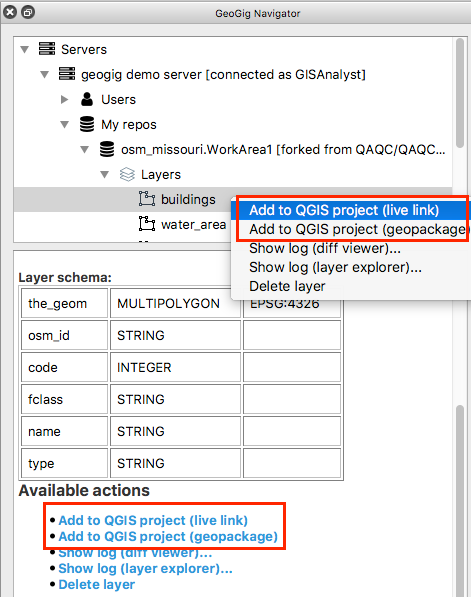
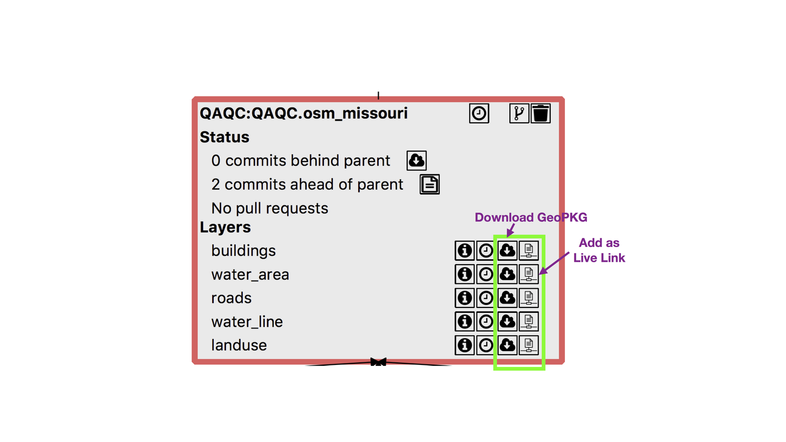
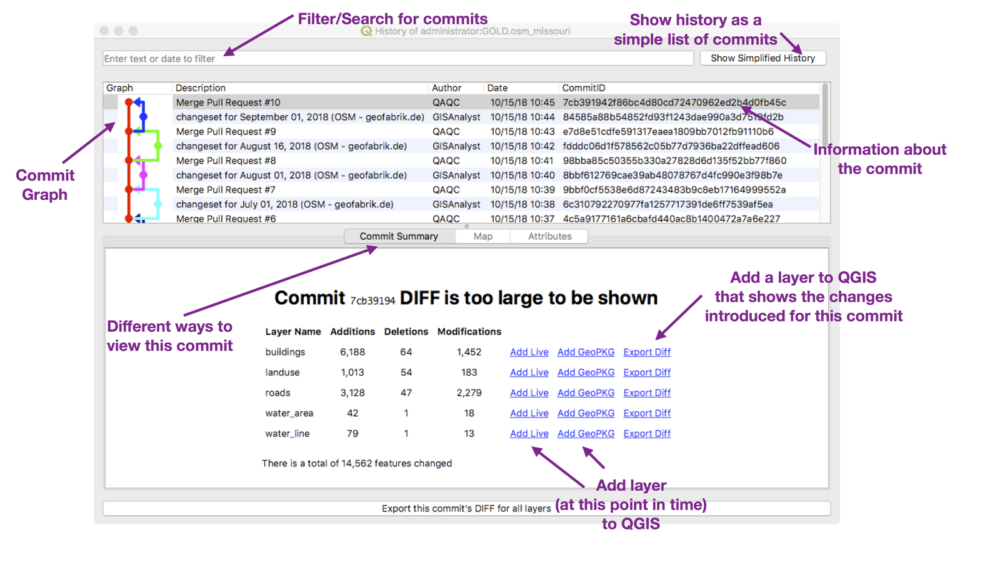
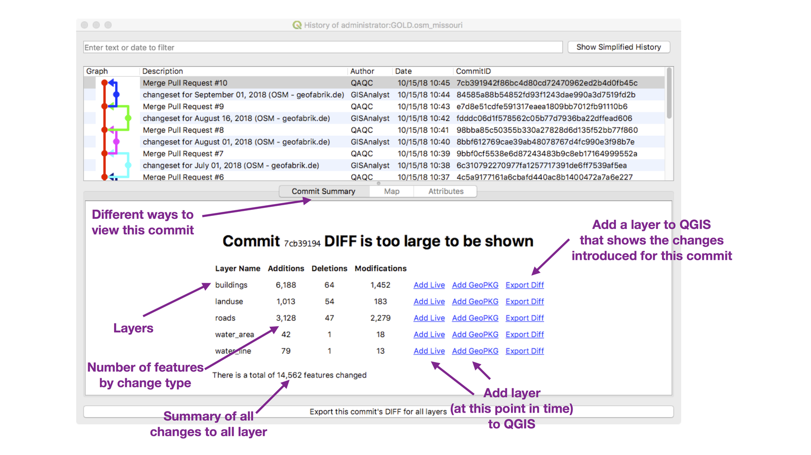
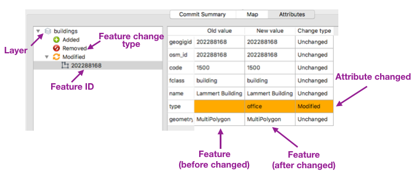
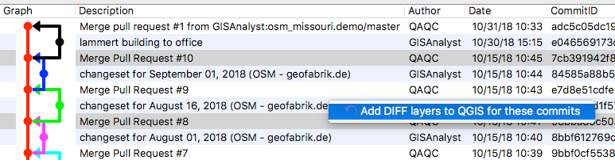
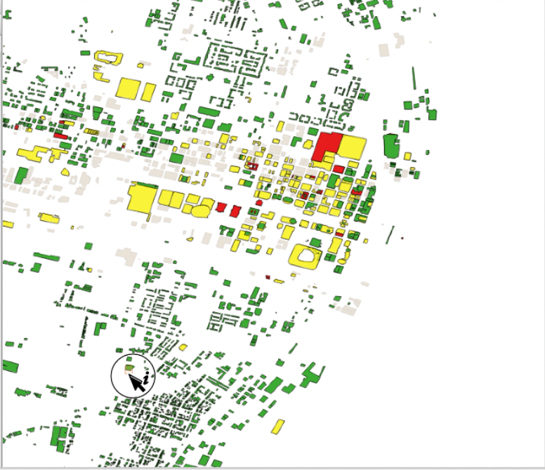
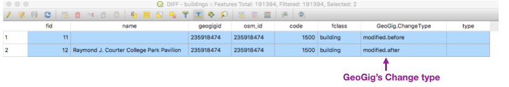

Viewing Data and Exploring History
==================================

.. raw:: html

    
<iframe src="https://player.vimeo.com/video/298415397#t=17m12s?title=0&byline=0&portrait=0" width="640" height="360" frameborder="0" webkitallowfullscreen mozallowfullscreen allowfullscreen></iframe>
     <a href="https://vimeo.com/295261790">GeoGig Quick Start - Looking At Data</a>
 
    
    

In this section, we will be looking at adding GeoGig layers to QGIS and viewing the history of a repository.

GeoGig Server VM sample Data
----------------------------

The GeoGig Server VM comes with several layers of `Open Street Map Data (OSM) <http://openstreetmap.org>`_ from `Geofabrik.de <http://download.geofabrik.de/>`_.

The dataset consists of these layers for the state of Missouri:

.. list-table:: 
   :header-rows: 1
   :widths: 20 80

   * - Layer
     - Description
   * - Buildings
     - Building footprints
   * - Roads
     - Roads and highways
   * - water_area
     - polygons representing lakes and large rivers
   * - water_line
     - lines representing rivers
   * - landuse
     -  polygons representing primary use of land by humans
 

It also contains snapshots of the OSM dataset at 10 points in time:

.. list-table:: 
   :header-rows: 1

   * - Snapshot Date 
   * - January 1, 2014
   * - January 1, 2015
   * - January 1, 2016
   * - January 1, 2017
   * - January 1, 2018
   * - July 1, 2018
   * - August 1, 2018
   * - August 16, 2018
   * - September 1, 2018

NOTE: these are the state of the actual OSM dataset at these points in time.  The OSM dataset was started in 2004 and is continuously updated.

Add a GeoGig Layer to QGIS
--------------------------

You can add a GeoGig layer to your QGIS project very easily through either the :guilabel:`Navigator` or the :guilabel:`Constellation Viewer`. 

You can, also, add an older revision of the dataset using the :guilabel:`History Viewer` (see below).

In the Navigator
^^^^^^^^^^^^^^^^

1. Use the Navigator's tree to open the repository that contains the layer you want.
2. Look in the :guilabel:`Layers` folder.
3. Either 

   * Click either :guilabel:`Add to QGIS project (live link)` or :guilabel:`Add to QGIS project (geopackage)` in the info section (below the tree)

   * Right-click on the layer you want to add and select either :guilabel:`Add to QGIS project (live link)` or :guilabel:`Add to QGIS project (geopackage)`.

See `GeoPKG Layers <gpkgandlivelayers.html>`_ for more information about the difference between GeoPKG and Live layers.  See below for how to add historical versions of the dataset.

In the Constellation Viewer
^^^^^^^^^^^^^^^^^^^^^^^^^^^

1. Use the Navigator to open the :guilabel:`Constellation Viewer` (right-click on a repository and choose :guilabel:`Show Repo Constellation`).
2. In the the :guilabel:`Constellation Viewer`, find the repository you want the layer to come from.
3. In the Repository's :guilabel:`Layer` section, find the layer you are interested in.
4. Either

   * Click on the :guilabel:`Add as Live Link` icon (document connected to network).
   * Click on the :guilabel:`Download GeoPKG` icon (cloud with a arrow pointing down).

See `GeoPKG Layers <gpkgandlivelayers.html>`_ for more information about the difference between GeoPKG and Live layers.  See below for how to add historical versions of the dataset.

 
Viewing History
---------------

.. raw:: html

    
<iframe id="no2" src="https://player.vimeo.com/video/298415397#t=20m10s?title=0&byline=0&portrait=0" width="640" height="360" frameborder="0" webkitallowfullscreen mozallowfullscreen allowfullscreen></iframe>
     <a href="https://vimeo.com/295261790">GeoGig Quick Start - Viewing History</a>
 
    
    

The :guilabel:`History Viewer` lets you see all the changes made to a repository or layer.  It also allows you to "travel in time" and see what the dataset looked like in the past. 

You can open the :guilabel:`History Viewer` either from the :guilabel:`Navigator` window or the :guilabel:`Constellation Viewer`. 
The history viewer can be either opened at the repository level (showing all changes for all layers) or at an individual layer level (only showing changes that affect a single layer). 

The History Viewer
^^^^^^^^^^^^^^^^^^

    The History Viewer

The :guilabel:`History Viewer` has two main parts;

* Commit Viewer (at the top) - this shows all the commits (changesets) made to the repository/layer
* Commit Details (at the bottom) - there are three tools for looking at a commit's details (:guilabel:`Commit Summary`, :guilabel:`Map`, :guilabel:`Attributes`)

The History (Commit) Graph/List
^^^^^^^^^^^^^^^^^^^^^^^^^^^^^^^

The Commit Graph/List is at the top of the :guilabel:`History Viewer`.  The main portion has a list of each commit, as well as a graph showing the connection between commits.

Each commit has the following information:

.. list-table:: 
   :header-rows: 0
   :widths: 20 80

   * - Graph
     - graphical history of commits (i.e. Pull Requests)
   * - Description
     - the description the user entered when making the commit
   * - Author
     - who made the commit
   * - Date
     - when the commit was made
   * - CommitID
     - GeoGig unique ID used to identify this commit
 

Typically, the branching/merging of the graph indicates what the state of the datasets were when an independent workspace (repository) was created to hold changes for a workflow.  A merging commit in the graph indicates that a Pull Request was made and accepted.  See the `workflow <workflow.html>`_ and `synchronization <../synch.html>`_ sections and the `Introduction to GeoGig <https://vimeo.com/295261790>`_, `Quick Start <https://vimeo.com/298415397>`_, and `Synchronization <https://vimeo.com/296981752>`_ videos for details of interpreting commit history graphs.

There are also two tools, at the very top;

* Search Box - this is to help find commits.  Type in some text here to filter the commit list
* :guilabel:`Show Simplified History` - this shows the history as a simple list of changes (all the workflow - merge - commits are not shown)

Exploring a Commit
^^^^^^^^^^^^^^^^^^

The bottom section of the History window shows details about the commit selected in the top (Graph/List) section.

There are three ways to look at this commit - :guilabel:`Commit Summary` tab, :guilabel:`Map` tab, and the :guilabel:`Attributes` tab.

The :guilabel:`Map` and :guilabel:`Attributes` tab are only available if the commit modified less than 1500 features (for large commits, use the tools available in the :guilabel:`Commit Summary` tab).

Summary Tab
"""""""""""

   The Commit Summary tab

The :guilabel:`Summary` tab gives more information about a single commit selected in the Graph/List.  For each layer, it gives you the number of features that that this commit added, deleted, and modified.  It also allows you to;

* :guilabel:`Add Live` - add a live layer to QGIS that will show the layer as it was after this commit was made (time-travel)
* :guilabel:`Add GeoPKG` - download a GeoPKG layer to QGIS that will show the layer as it was after this commit was made (time-travel)
* :guilabel:`Export Diff` - Add a layer to QGIS that details all the changes to the layer introduced by this commit (see below)

There is also an :guilabel:`Export commit's DIFF for all layer` button that will add a diff layer for each layer modified in the commit (see below).

Attribute Tab
"""""""""""""

    The Attribute Tab

The :guilabel:`Attribute` tab shows the details of all features changed in a single commit.  It has two parts - the feature tree (left) and change details (right).

Select a feature in the feature tree and the change details section will show the feature before the commit (:guilabel:`Old Value`) and after the commit (:guilabel:`New Value`). This allows you to dive deep into the changes introduced during a commit.

NOTE: this tab is only available if less than 1500 features were modified by the commit.

Map Tab
"""""""

The map view shows an overview map of all the features modified in this commit.

NOTE: this tab is only available if less than 1500 features were modified by the commit.

.. _refExportDiff:

Exporting a Commit Diff
^^^^^^^^^^^^^^^^^^^^^^^

If a commit has a lot of changes, it is beneficial to export the Diff ("Difference").  This can be done in two ways;

* Single Commit Diff - press the :guilabel:`Export Diff` or :guilabel:`Export commit's DIFF for all layer` button.  This will show the differences made by a single commit.
* Select two commits in the Graph/List, right-click and select :guilabel:`Add DIFF layers to QGIS for these commits`.  This will show the differences made between any two commits.

    Selecting any two commits then right-click to see the differences between them

    The resulting diff layer 

The diff layer will show all the changes in three colors:

* Adds - in green
* Deletes - in red
* Modification - in two shades of yellow (both the before-change and after-change feature will be shown)

  
    Attribute table for the diff layer

View the diff layer's attribute table for more details.  The attribute table will show, for each changed feature, what kind of change was done (Add, Delete, or Modify) - in the "GeoGig.ChangeType" column.  It also shows all the attributes for the feature.  For a modification, there are two entry rows in the attribute table - the feature as it was before the change and the feature as it was after the change.

NOTE: exporting a large diff can take some time (several minutes).
