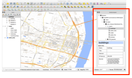
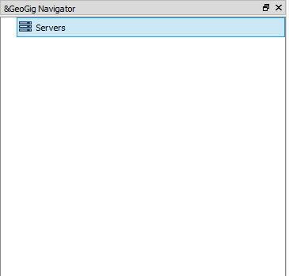
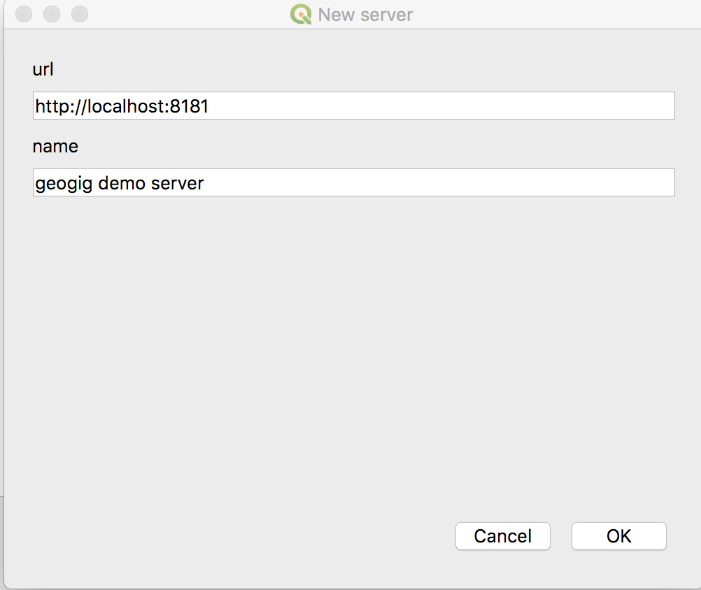
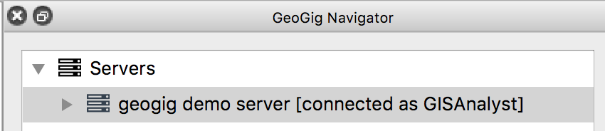
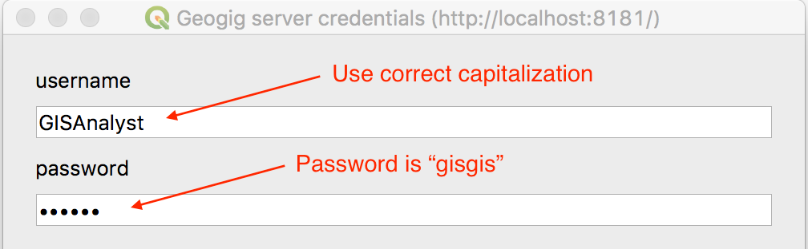
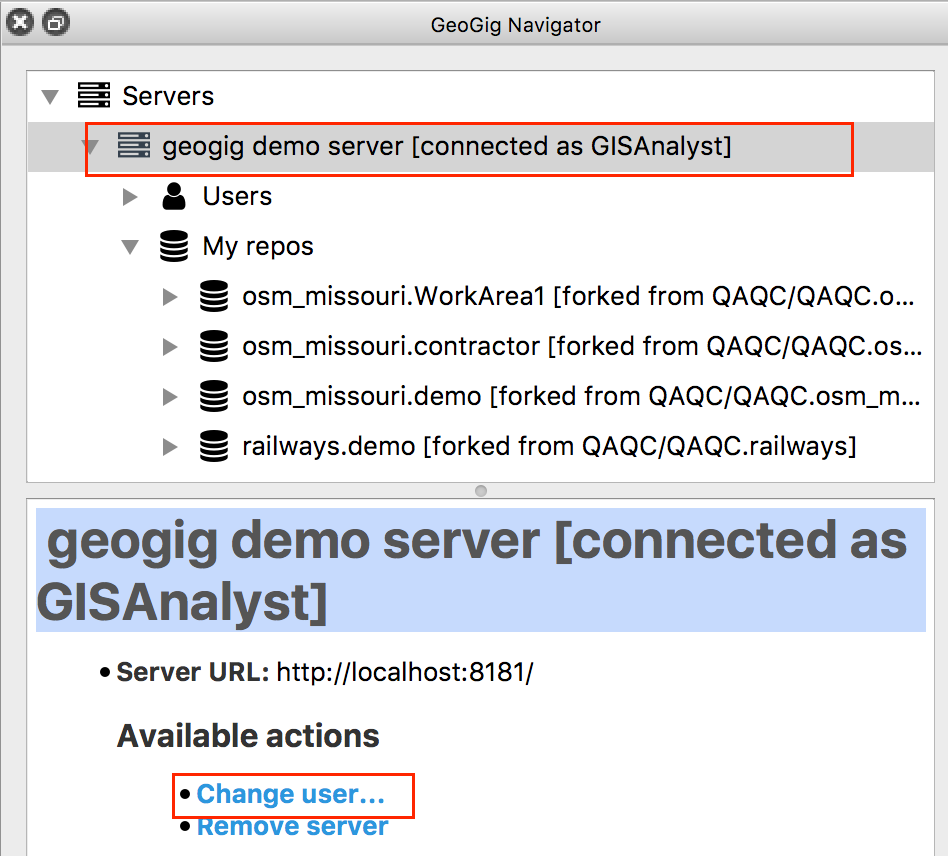

Connecting to the GeoGig Server
===============================

.. raw:: html

    
<iframe src="https://player.vimeo.com/video/298415397#t=6m53s?title=0&byline=0&portrait=0" width="640" height="360" frameborder="0" webkitallowfullscreen mozallowfullscreen allowfullscreen></iframe>
     <a href="https://vimeo.com/295261790">GeoGig Quick Start - Connecting to the Server</a>
 
    
    

Connecting to the GeoGig Server for the First Time
--------------------------------------------------

The :guilabel:`GeoGig Navigator` panel is the plugin's primary tool to interact with the GeoGig repositories. It is normally located on the right hand side of the main QGIS window. If the :guilabel:`GeoGig Navigator` panel is not visible, you can open it from QGIS's main menu - :menuselection:`Plugins --> GeoGig --> GeoGig Navigator`.

   The Navigator panel is normally located to the right of the main QGIS window

   GeoGig Navigator panel

The :guilabel:`Navigator` contains a tree with the GeoGig WebAPI servers that are already defined. To define a connection to an existing GeoGig WebAPI server, right-click on the :guilabel:`Servers` item and then select :guilabel:`Add new server`. You will see the following dialog:

   Server definition dialog

Enter the URL of the server ("http://localhost:8181" is the default for the GeoGig Server VM) and the name to identify it ("geogig demo server"). Click on OK and the server will be added to the navigator.

   Server item in Navigator

Connecting as a User
--------------------

To see the content of the server and start working with its data, you must first connect to it. Right-click on the server item and select :guilabel:`Connect`. You will be prompted to enter your user name and password. On the GeoGig Server VM, the following users are available;

=============  =============  
User           Password    
=============  =============   
administrator  administrator
QAQC           qaqaqa
GISAnalyst     gisgis  
dblasby        dblasby
=============  =============   

|

In most cases, you will want the "GISAnalyst" user (make sure that you use the correct capitalization).

Once connected, the navigator will show the contents of that server under its item.

   Connecting to the Server

Working with the GeoGig plugin is mostly done using the right-click context menus of the different items in the :guilabel:`Navigator` tree. We will now describe some common workflows and explain the required commands for each of them.

Changing Logged on User
-----------------------

If you want to connect as a different user, select the server in the :guilabel:`Navigator` then choose :guilabel:`Change User...` (either from the bottom part of the panel or by right-clicking on the Server item)

   Changing the user you're connected as

You'll be asked for a new user/password (see above for user names and password defined in the GeoGIG Server VM).

