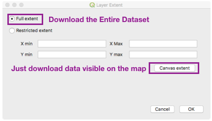
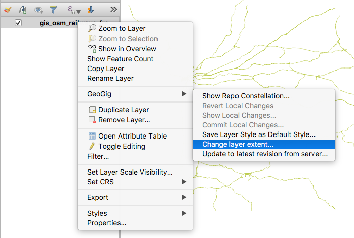
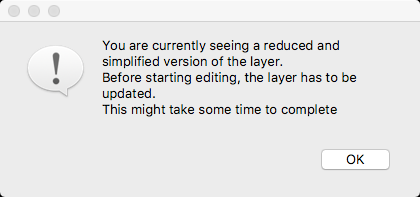
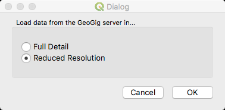
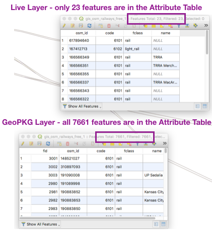

Geopackage layers and live layers
==================================

There are two ways of adding a layer from a GeoGig repository to the current QGIS project: using a GeoPackage file and using a Live connection. Although functionality is very similar, each of them represent different approaches with their own pros and cons - described in the sections below.

Which one should you use?
-------------------------

In most cases we recommend a Live connection. 

However, you may want to use a GeoPackage if;

* The Attribute Table difference is important for your analysis (see below)
* Your connection to the GeoGig server is slow
* You want to do `Disconnected Editing <../disconnect.html>`_

Geopackage layers
------------------

A geopackage layer is an extract of the layer in the GeoGig repository, stored as a GeoPackage file. Once the layer has been downloaded from the server, a connection to that server is not needed, unless changes to the layer want to be committed to the repository.

The GeoPackage is opened and it behaves in QGIS just like any other file-based layer, allowing both off-line and on-line work.

The extent of the layer can defined when downloading it, in a dialog like the one shown below.  The entire dataset can, also, be downloaded.

    Selecting to download the entire dataset or part of it

    Right-Click on layer for a GeoPackage layer

The extent can be changed at any time, provided that there is connection to the server. Right-click on the layer in the QGIS layers list and select :guilabel:`Change layer extent...`. The extent selection dialog will be shown and you will be able to select a new extent.  You can also update the geopackage with any changes from the server by using :guilabel:`Update to latest revision on server...`.

If there are local uncommitted changes to the GeoPackage, the extent cannot be changed nor can it be updated.

.. figure:: ../img/disc1.png

   Hover over a GeoPackage layer to find it's location on your computer

The geopackage files that are created with the repository data are stored at `[base_gpkg_folder]/[username]/[repository_name]/[layer_name]/[id]/[layer_name].gpkg`

That means that, if adding the same layer from a repository to a QGIS project (or different projects) several times, multiple files are created. The `id` part of the filename is an arbitrary string assigned when creating the file.

The base geopackage folder can be configured in the plugin options (open :guilabel:`Plugins/GeoGig/Plugin settings`). If not configured, it defaults to `[user_folder]/geogig`

The GeoPackage tracks changes made to it so they can easily be committed to the GeoGig repository at any time.

Live layers
-----------

A live layer requires a constant connection to the GeoGig server. The content of the layer depends on the extent currently displayed in the QGIS map canvas and the layer configuration.  Any change in the canvas extent (and also in the layer symbology) will cause the layer content to change. A query to the server is required for this, and the server connection is therefore mandatory. Live layers are not valid for off-line use.

The mechanism is similar to what happens with a PostGIS database connection.

For a given resolution and extent, not all data within that extent is retrieved from the server. The download is optimized, so only data relevant at that resolution is downloaded - features will be generalized and some small features removed.  Only features relevant to the current style will be retrieved.

When editing a live layer, you need to have the real (full-resolution) geometries instead of the simplified ones. For that reason, when you start editing a live layer, the GeoGig plugin will update that layer to get the full geometries (non-generalized), and it will inform you with a message like the one shown below.

   Warning when starting to edit a Live GeoGig layer

You can switch between the full detail mode and the optimized (geometry generalization and some small geometries removed) mode by right-clicking on the layer in the QGIS layers list and selecting :guilabel:`Change data optimizations`.  In most cases this is not necessary to change, however, if you need the full resolution geometries for analysis then you will need to change this setting to "Full Details."

   Live layer data optimizations

When using a live layer, local changes - if they are not committed - can only be stored if the project is saved.

If a live layer is saved as part of a project, the project will automatically connect the layer to the server when re-loaded, so data is downloaded when the layer is first rendered. However, if you haven't connected to the corresponding repo using the GeoGig Navigator and with the same user, you will have to enter a username and password. Once you are connected to the server, you won't need to re-enter your credentials during your QGIS session when opening layers that use that connection.

Live layers and the Attribute Table
^^^^^^^^^^^^^^^^^^^^^^^^^^^^^^^^^^^

There is a difference between a normal QGIS layer and a GeoGig Live layer.  If you open the Attribute Table for a normal QGIS layer (or a GeoGig GeoPackage layer), you will see ALL the features for the layer.  However, for a Live GeoGig layer you will only see the features that are actually being drawn - those are features that match the style, are visible on the map's extents, and some small features maybe removed.  Some types of analysis may need all the features - if so, use a GeoPackage connection.

A GeoGig GeoPackage connection behaves like a normal QGIS layer. 

   Zoomed in on a layer - the Live layer's Attribute Table only shows a few features

The Quick Start video shows this issue:

.. raw:: html

    
<iframe frameborder="1" src="https://player.vimeo.com/video/298415397#t=35m04s?title=0&byline=0&portrait=0" width="640" height="360" frameborder="0" webkitallowfullscreen mozallowfullscreen allowfullscreen></iframe>
     <a href="https://vimeo.com/295261790">GeoGig Quick Start - GeoPKG and Live</a>
 
    
    

