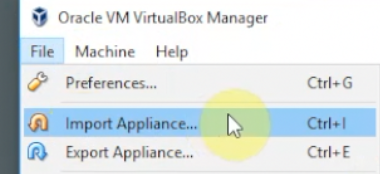
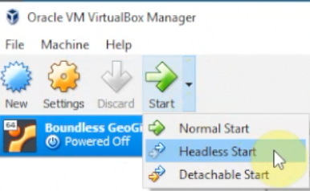
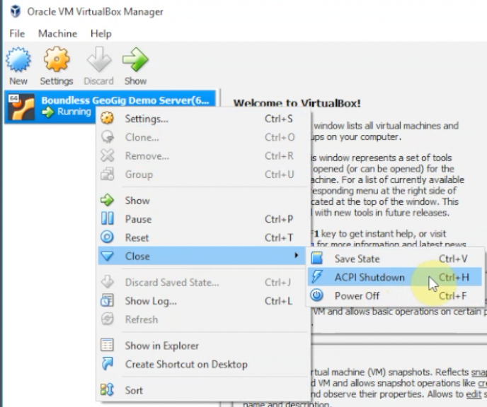
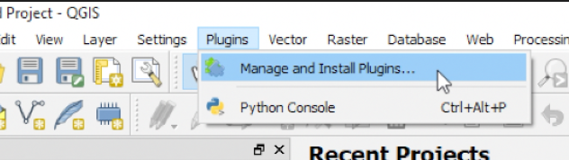
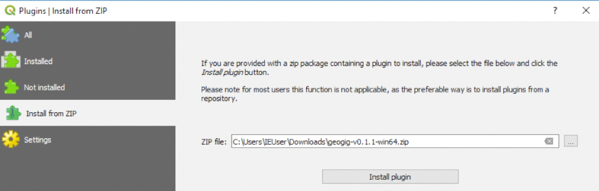

Installing
==========

.. raw:: html

    
<iframe frameborder="1" src="https://player.vimeo.com/video/298415397#t=32s?title=0&byline=0&portrait=0" width="640" height="360" frameborder="0" webkitallowfullscreen mozallowfullscreen allowfullscreen></iframe>
     <a href="https://vimeo.com/295261790">GeoGig Quick Start - Installation</a>
 
    
    

What you need
--------------

The easiest way to run the GeoGig Server is to use our pre-configured Virtual Machine (VM).  Please see the install video, above, for details.  The GeoGig Server VM comes pre-configured with same sample dataset and repositories.  You'll need Virtual Box to run the GeoGig Server VM.

You will need to download four items.

For the GeoGig Server - a virtual machine (VM) with the GeoGig Server configured and running. This will provide the GeoGig software that will take care of versioning and managing your data. You can think of it as a spatial database that offers a lot more than most spatial databases:

* `Virtual Box Installer <https://www.virtualbox.org/wiki/Downloads/>`_ 
* `GeoGig Server .OVA <https://www.locationtech.org/>`_

GeoGig QGIS Plugin - the GeoGig QGIS plugin is needed to add GeoGig capabilities to QGIS. The plugin is not available *yet* from the QGIS plugins server, so it must be installed manually:

* `QGIS 3 Installer <https://www.qgis.org/en/site/forusers/download.html>`_
* `QGIS-GeoGig plugin <https://github.com/boundlessgeo/qgis-GeoGigclient-plugin/releases/download/v0.1.1/GeoGig-v0.1.1.zip>`_

Installing the GeoGig Server via a Virtual Machine
--------------------------------------------------

1. Install Virtual Box (install with its default options).  
   More details are available in `Install the virtual Machine <../vm.html>`_ and the install video (above)
2. Go To  :menuselection:`File --> Import Appliance`

3. Choose the GeoGig Server .OVA and import it

Starting the VM
^^^^^^^^^^^^^^^

1. Start Virtual Box
2. Click on the "Boundless GeoGig Server" Virtual Machine
3. Click the little arrow next to :guilabel:`Start` and choose :guilabel:`Headless Start` (You can also right click on the Geogig VM)

4. Wait a few minutes to give the VM a chance to boot and start the GeoGig Server

Stopping the VM
^^^^^^^^^^^^^^^

1. Start Virtual Box
2. Right-Click on the GeoGig Server Virtual Machine
3. From the menu choose, :menuselection:`Close --> ACPI Shutdown`

4. Wait a few moments for the VM to stop
5. When the VM shows a :guilabel:`Powered Off` status, you can quit Virtual Box

Installing the GeoGig QGIS3 Plugin
----------------------------------

To use the QGIS-GeoGig plugin, you need to install QGIS and then install the plugin inside QGIS.

Installing QGIS
^^^^^^^^^^^^^^^

Double-click on the QGIS installer - it will walk you through the install process.  See the video, above, for more details.

Installing the Plugin
^^^^^^^^^^^^^^^^^^^^^

1. Run QGIS (if asked, choose a "fresh start")
2. In the main menus choose :menuselection:`Plugin --> Manage and Install Plugins...`

3. Choose :guilabel:`Install from Zip` and choose the QGIS-GeoGig plugin ``.zip`` file

4. Press :guilabel:`Install Plugin`

