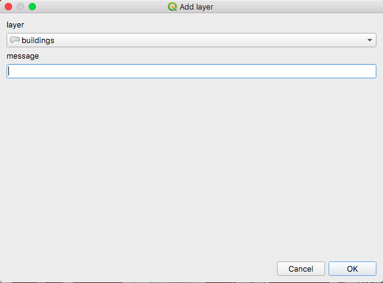
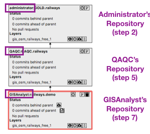

Adding Your Own Data to GeoGig
==============================

.. raw:: html

    
<iframe frameborder="1" src="https://player.vimeo.com/video/298415397#t=42m10s?title=0&byline=0&portrait=0" width="640" height="360" frameborder="0" webkitallowfullscreen mozallowfullscreen allowfullscreen></iframe>
     <a href="https://vimeo.com/295261790">GeoGig Quick Start - Installation</a>
 
    
    

Using the GeoGig QGIS plugin you can add your own data (vector layers only) to a GeoGig server, and then work normally with it (editing layers, committing new versions to the repository, performing workflow operations, and exploring history).

Creating an Empty Repository
----------------------------

You can add new layers to an existing repository which already contains other layers. However, we will start fresh and create an empty repo to contain your data.

To create a new empty repository, right-click on the :guilabel:`My repos` item of the server and select :guilabel:`Create repository`. Provide a name to describe the repository, click on :guilabel:`OK`, and the repo will be added.

The new repository contains no data and no commits.

Importing a Layer
------------------

In order to import a layer to a GeoGig repository, first load it into QGIS (:guilabel:`Layer -> Add Layer -> Add Vector Layer`). All data sources are supported. The GeoGig plugin will take care of sending your feature data in the correct format that is supported by GeoGig.

Right-click the repository item in the :guilabel:`Navigator` and select :guilabel:`Add layer`. You will see the following dialog.

At the top, select the layer you want to export to GeoGig, enter a commit message, and click on :guilabel:`OK`.  GeoGig will send the data to repository.

The layer content is now in the repository, and you have created the first commit. The current style of the layer has also been uploaded to the repository and set as the default one for that layer (see `Saving Styles <style.html>`_).

If you look at the repository history, the log contains the commit you just made.

If you want to do further work with the layer that you just added, you cannot use the original layer anymore. Instead, you have to work with a layer that is linked to the repository.

Close your current QGIS project and start a new blank one, then add the layer from the repository.

Creating the QA/QC Workflow Repositories
----------------------------------------

If you want to follow the QA/QC workflow, you will not want to work directly against the repository that you just created and populated with your new layer. Instead, you need other (linked) repositories that contain the same data and support creating Pull Requests to move changes across repositories using the `QA/QC workflow <workflow.html>`_ (Work Repository -> QA/QC Repository -> Gold/Published Repository).

To create these intermediate repositories, you have to fork the original one. Forking a repository means creating an identical copy of the repository, with the same history and data, that is linked to the original one (in the same repository constellation). Each forked repository is independent, and can have its own history and changes.

To fork a repository, select the corresponding repository item in the :guilabel:`Navigator`, right-click on it and select :guilabel:`Fork repository`. You will be prompted to enter the name of the forked repository (for instance, "QA/QC repository).

The forked repository will belong to the user that is logged in when performing the clone operation. 

The forked repository can be itself forked following the same procedure that we just described.

1. Login as the "administrator" user (password - administrator)
2. Create a repository (likely named with either "GOLD" or "PUBLISHED" in the title)
3. Add your layer(s) to this repository (see above)
4. Login as the "QAQC" user (password - qaqaqa)
5. Fork the repository you created in step 2:

   * In the :guilabel:`Navigator`, open the :guilabel:`Users` folder
   * Open the :guilabel:`administator` folder
   * Select the repository you created in step 2
   * Right-Click and select :guilabel:`Fork repository...`
   * Give the repository a name (likely with "QAQC" in the name)
6. Login as the "GISAnalyst" user (password - gisgis)
7. Fork the repository you created in step 5:

   * In the :guilabel:`Navigator`, open the :guilabel:`Users` folder
   * Open the :guilabel:`QAQC` folder
   * Select the repository you created in step 5
   * Right-Click and select :guilabel:`Fork repository...`
   * Give the repository a name (i.e. "WorkArea1")

At this stage, you can add the layer from the GISAnalyst's repository and go through normal workflow operations.

   The QA/QC Workflow repositories

