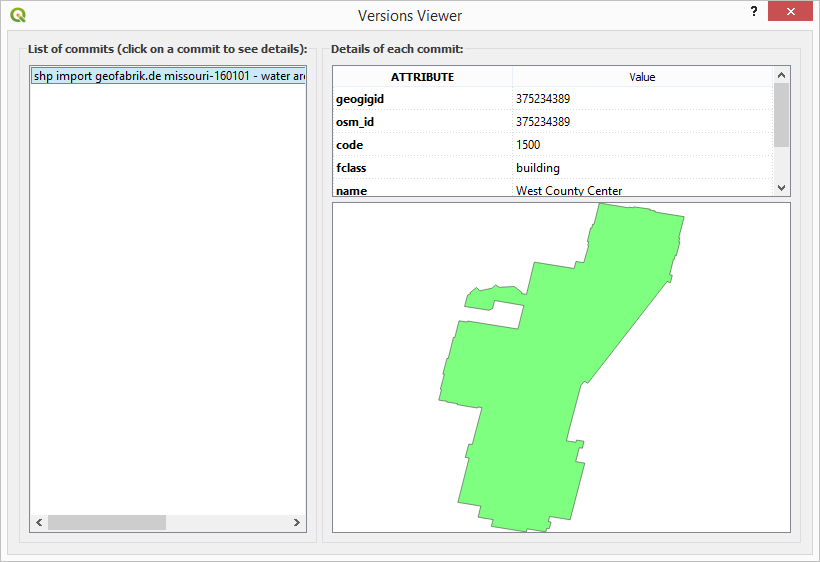
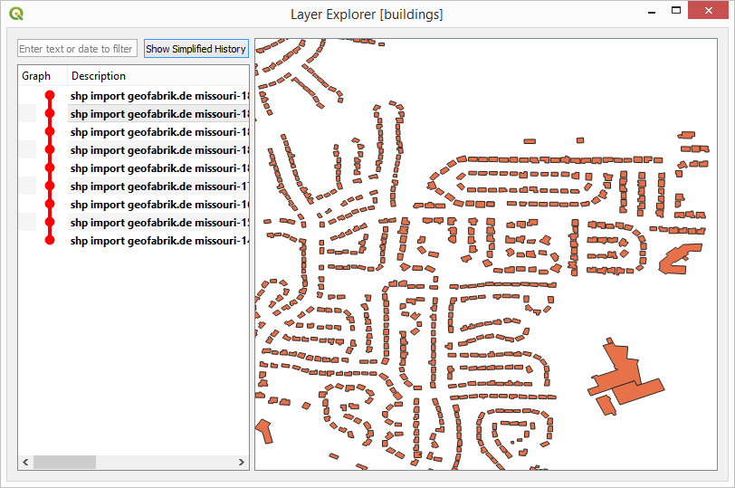

Other Tools
===========

The QGIS GeoGig plugin includes some additional tools. They are described in this section.  Both of these are shown in the Quick Start Video;

.. raw:: html

    
<iframe src="https://player.vimeo.com/video/298415397#t=45m45s?title=0&byline=0&portrait=0" width="640" height="360" frameborder="0" webkitallowfullscreen mozallowfullscreen allowfullscreen></iframe>
     <a href="https://vimeo.com/295261790">GeoGig Quick Start - Editing </a>
 
    
    

GeoGig Feature Info Tool (Experimental)
---------------------------------------

The Feature Info tool is a map tool allows you to see the history of a single feature. 

The first step to use this tool is to activate it using the :guilabel:`Plugins -> GeoGig -> GeoGig Feature Info Tool` on the main QGIS menu.

The tool operates on the current active layer (which must be a GeoGig layer), so you have to select the layer you want to work with. The layer can be a live layer or a GeoPackage one.

On the map canvas, click on any feature on the active layer.  The history of changes for the selected feature will be shown in a new dialog.

   Feature history

You can click on any of the commits shown on the left-hand side of the dialog, and the feature data (geometry and attributes) corresponding to that commit will be shown on the right-hand side of the dialog.

Layer Explorer (Experimental)
-----------------------------

The :guilabel:`Layer Explorer` allows you to explore the different versions of a given GeoGig layer, without having to add them to your QGIS project.

To open it, select a layer item in the :guilabel:`Navigator`, right-click on it and select :guilabel:`Show Log (Layer Explorer)`.

   Layer Explorer

The :guilabel:`Layer Explorer` dialog has a design similar to the :guilabel:`GeoGig Feature Info Tool` dialog that is used for showing the different versions of a feature (see previous section). When a commit is selected on the left-hand side of the dialog, the layer is shown on the canvas on the right-hand side. You can zoom and pan on that canvas, as you would on the main QGIS window.

Additional functionality is available by right-clicking on the commit items, and can be used to, for instance, add the layer at a given commit to the current QGIS project.

NOTE: if your style does not show features when zoomed out (like the buildings style in the GeoGig Server VM), then you will need to zoom in to see the features.  This can be difficult, so you may want to change the style so it is visible when zoomed out - see `Styling <style.html>`_.
