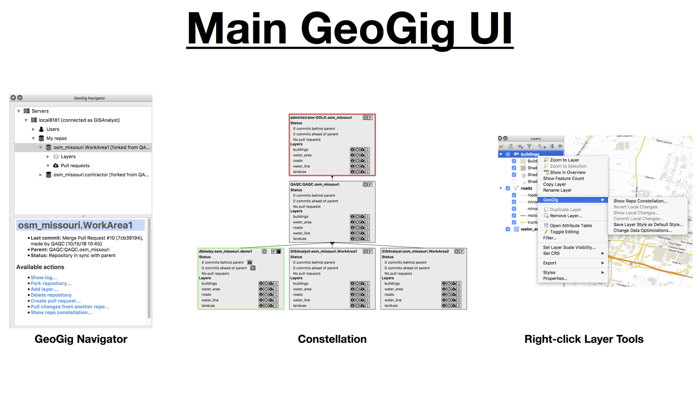
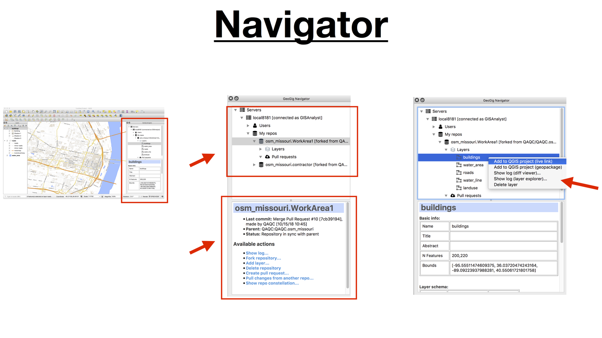
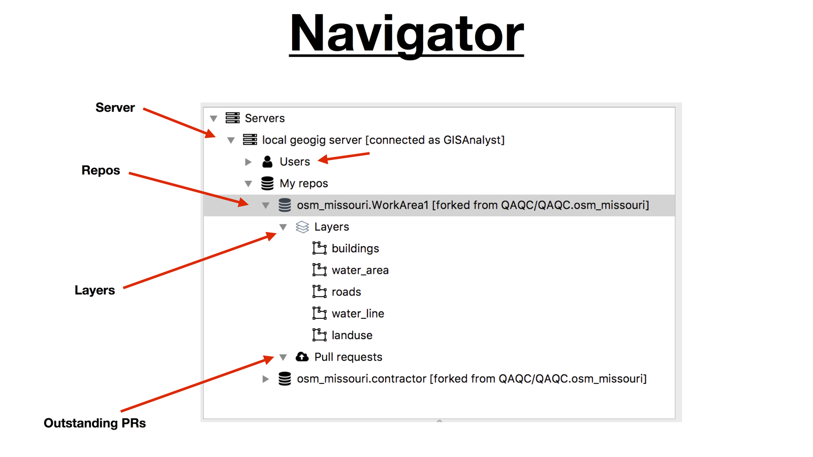
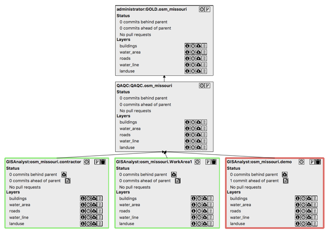
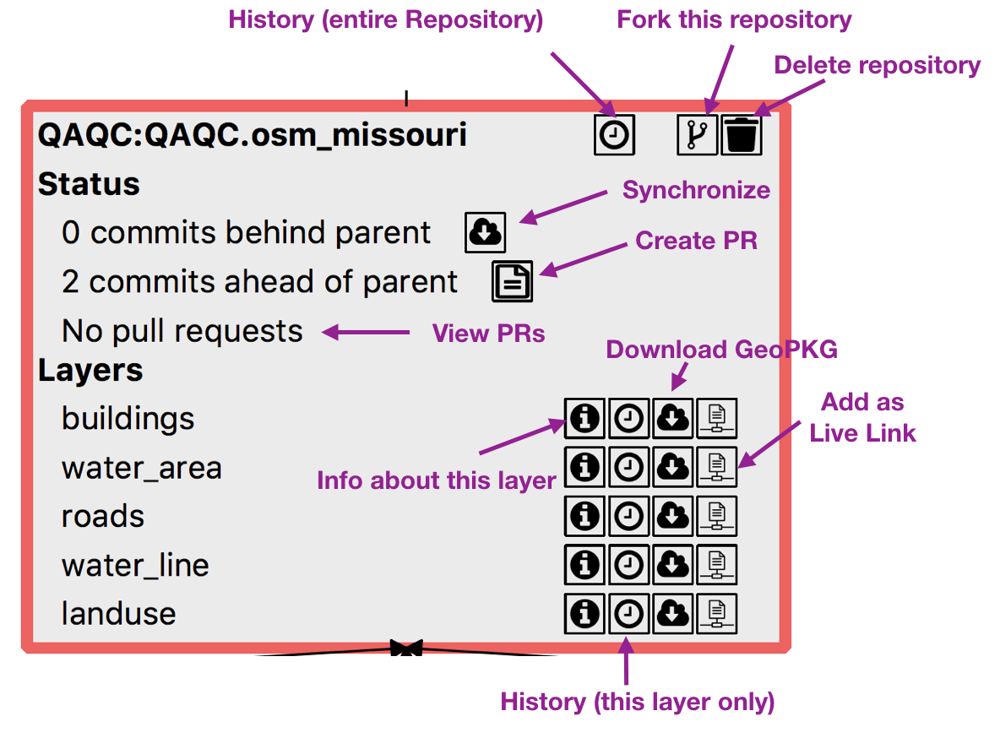
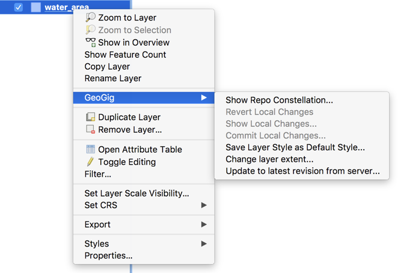

UI Basics
=========

   Main GeoGig UI Components

.. list-table:: Main GeoGig UI Components
   :header-rows: 0
   :widths: 25 75

   * - Navigator
     - Provides a hierarchical view of several GeoGig servers and all their components (repositories, layers, and pull requests).  Good for exploring repositories and provides full functionality.
   * - Constellation
     -  Provides a graphical view of a single set of related repositories.  Good for understanding connections between repositories and doing workflow related tasks.
   * - Right-Click Layer Menu
     -  Provides access to layer specific information and tools. 

The Navigator
-------------

The :guilabel:`Navigator` is typically located on the right side of the main QGIS window.  You can hide/view the Navigator by selecting :menuselection:`Plugins --> GeoGig --> GeoGig Navigator`.

.. figure:: ../img/nav1.png

   The Navigator panel is normally located to the right of the main QGIS window

The :guilabel:`Navigator` windows consists of two parts:

* a tree at the top showing a hierarchical view of GeoGig servers and their components (repositories, layers, pull requests)
* information and commands in the bottom panel for the selected object in the tree

The commands shown in the bottom portion are also available by right-clicking on an item in the tree.

   Overview of the Navigator

The :guilabel:`Navigator` tree's hierarchy is show in the this diagram:

   The Navigator Tree

The :guilabel:`My repos` folder shows the repositories that you (the logged in user) own.  The :guilabel:`Users` folder shows repositories that other people own.  Repositories are the basic unit in GeoGig - they contain multiple layers and workflow operations are based on them.

Repo Constellation
------------------

When working with several repositories, a helpful tool is the :guilabel:` Constellation Viewer`. It shows a global view of all the repositories that are related (forked).  It makes it easy to view difference between related repositories and move changes between them.  The :guilabel:` Constellation Viewer` shows the parent-child relationship ("fork") between repositories, as well as highlights changes (:guilabel:`Status`) between parent-child repositories.  This makes is idea for workflow operations (moving changes between repositories).

Repositories in a constellation can belong to different users.

To open the :guilabel:` Constellation Viewer` with the constellation corresponding to a given repository, right-click on the repository item (in the :guilabel:`Navigator`) and select :guilabel:`Show repo constellation`

   Constellation Viewer

You can manipulate repositories and layers in the :guilabel:`Constellation Viewer` much like you do in the :guilabel:`Navigator`; both have similar functionality.

The repository that you selected in the :guilabel:`Navigator` (the one selected when you chose :guilabel:`Show repo constellation`) is displayed with a red border. Repositories that belong to the logged user are displayed with a green border.  Repositories owned by others have a black border.

Repositories belonging to the logged user have more functionality enabled than those that belong to a different user.

   Constellation Viewer Details for a Single Repository

All the tools that are available in the :guilabel:`Navigator` are available in the :guilabel:`Constellation Viewer`.

Right-click on Layer
--------------------

There are a few specific tools available for layers.  You can access these tools by right-clicking on the layer (in the QGIS :guilabel:`Layers` panel) and selecting the :guilabel:`GeoGig` sub-menu.

  Layer specific GeoGig tools

.. list-table:: Available Tools
   :header-rows: 0
   :widths: 35 65

   * - Show Repo Constellation
     - Open the Constellation (selects the repository this layer is a part of)
   * - Revert Local Changes
     - Undo/delete any local changes you have (uncommited changes)
   * - Show Local Changes
     - Show local changes you have (uncommited changes)
   * - Commit Local Changes
     - Commit (to the GeoGig repository) any local changes you have (uncommited changes)      
   * - Save Layer Style as Default Style
     - Set this layer's style as the default style for the layer for this repository (see `default styles <style.html>`_)
   * - Change Layer Extent (GeoPKG only)
     - Re-get a subset of data from the GeoGig server (see `GeoPKG Layers <gpkgandlivelayers.html>`_)   
   * - Update to latest revision from server (GeoPKG only)
     - Apply changes from the GeoGig server (see `GeoPKG Layers <gpkgandlivelayers.html>`_) to the GeoPKG           
   * - Change Data Optimization (Live only)
     - Turn on/off data optimization for the Live Layers (see `GeoPKG Layers <gpkgandlivelayers.html>`_) 

