Editing and Workflow
====================

.. raw:: html

    
<iframe src="https://player.vimeo.com/video/298415397#t=23m46s?title=0&byline=0&portrait=0" width="640" height="360" frameborder="0" webkitallowfullscreen mozallowfullscreen allowfullscreen></iframe>
     <a href="https://vimeo.com/295261790">GeoGig Quick Start - Editing </a>
 
    
    

To learn more about moving a change through the QA/QC workflow see the `Introduction to GeoGig <https://vimeo.com/295261790>`_  and `Quick Start <https://vimeo.com/298415397>`_ videos.
 

Editing
-------

Editing a GeoGig layer is almost exactly the same as editing any vector data in QGIS.  However, when you finish a QGIS editing session (from pressing the QGIS pencil icon to start editing until pressing it again to stop editing) you will be prompted to commit your changes to your GeoGig repository.  You can either commit immediately or you can accumulate a bunch of changes before committing.  We recommend having fewer (larger) commits as it makes the history shorter/easier to understand.
   

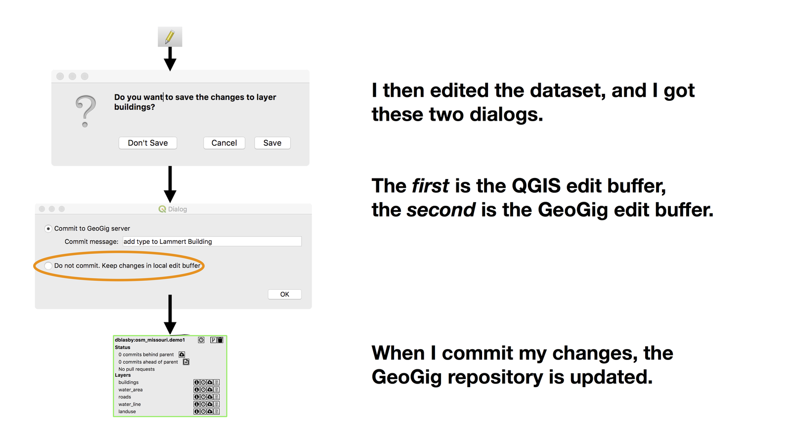

   The Two Edit Buffers (QGIS and GeoGig)

If a layer has local changes, the hovering over a layer (in the QGIS :guilabel:`Layers` panel) shows information about un-committed changes (as well as other information about the layer).  

For a GeoPKG layer, these changes are part of the GeoPKG.  For a Live layer, these changes are saved to a ``.changes`` file in the same directory as your QGIS project file (.qgz).  In order to save uncommitted Live layer changes, your project *must* be first saved before making changes.

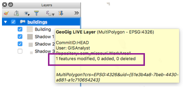

   Layer Hover - popup show information about the GeoGig layer, including information about local changes

If you have uncommitted local changes in your layer, right-clicking on the layer allows three options:

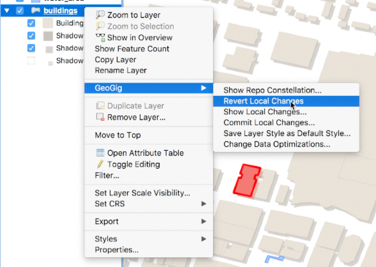

   Layer right-click menu - has options if there are local changes

* Revert Local Changes - Un-does the local changes (your local changes will be lost)
* Show Local Changes - Shows a history-like window showing the details of the uncommitted changes 
* Commit Local Changes - Commits the un-committed local changes (will ask you for a commit message) to the repository

Creating a Pull Request
-----------------------

When you've finished your editing work (perhaps over several days and several commits) and you want to move those changes to the (parent) QA/QC repository, you create a Pull Request.

You can create a PR from either the :guilabel:`Constellation Viewer` or the :guilabel:`Navigator`.

* On the :guilabel:`Constellation Viewer`, :guilabel:`Status` section press the icon next to the :guilabel:`X commits ahead of parent` line
* On the :guilabel:`Navigator`, select the repository then press :guilabel:`Create pull request`

When the :guilabel:`Create Pull Request` window appears:

1. Verify your work (see the `Synchronization <../synch.html>`_ section if GeoGig is recommending a synchronization)
   
   * On the :guilabel:`Info` (summary) tab, verify that the changes are what you expect (you can `"Export Diff" <addexplore.html#exporting-a-commit-diff>`_ to see all the changes)
   * On the :guilabel:`Commits` tab, verify that the commits are the ones you expect
   * On the :guilabel:`Commits` tab, dig into the commits to see the changes (either use the :guilabel:`Attributes` tab or you can `"Export Diff" <addexplore.html#exporting-a-commit-diff>`_ for that single commit)

2. Give your PR a name
3. Press :guilabel:`Create PR`
4. You will see the Pull Request associated with the QA/QC repository in the :guilabel:`Constellation Viewer` and :guilabel:`Navigator`.

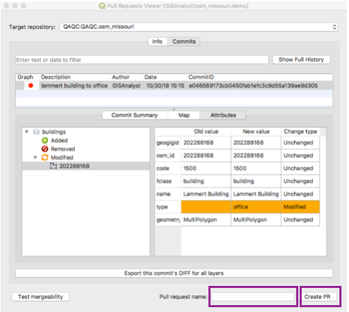

   Creating a Pull Request

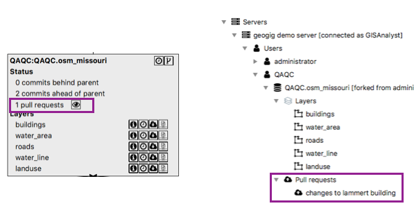

   Once the PR is created, it is connected to the parent's repository in the Navigator and Constellation view

Evaluating a Pull Request
-------------------------

1. Login as QAQC (or whomever owns the repo the PR is attempting to update)
2. Open the PR (either via the :guilabel:`Constellation Viewer` or :guilabel:`Navigator` - see above)
3. Verify the PR
 
   * On the :guilabel:`Info` (summary) tab, use `"Export Diff" <addexplore.html#exporting-a-commit-diff>`_ to see the changes in context.  You can also use the :guilabel:`Combined Changes` tab to see the changes (only for PRs with less that 1500 feature changes)
   * On the :guilabel:`Commits` tab, look through the commits to get an overview of what's changed
   * On the :guilabel:`Commits` tab, dig into the commits to see the changes (either use the :guilabel:`Attributes` tab or you can `"Export Diff" <addexplore.html#exporting-a-commit-diff>`_ for that single commit)
   * Run any QA/QC checks you would normally perform

4. Press :guilabel:`Merge PR`

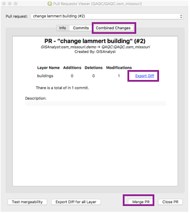

   Evaluating a Pull Request

Outline of the QA/QC Workflow
-----------------------------

1. Create a repository to do our work
2. Add the layer to QGIS
3. Edit the layer
4. Commit the change to GeoGig
5. Create a Pull Request to move the change to the (parent) QA/QC repository
6. Accept the Pull Request (QA/QC)

Example Workflow for the GeoGig Server VM
-----------------------------------------

We will work through an example using the GeoGig Server VM datasets and repositories.

To see more about moving a change through the QA/QC workflow see the `Introduction to GeoGig <https://vimeo.com/295261790>`_  and `Quick Start <https://vimeo.com/298415397>`_ videos.

Create a repository to do our work
^^^^^^^^^^^^^^^^^^^^^^^^^^^^^^^^^^

The first step is to create a Repository to do our work in.

1. Logon as the GISAnalyst User
2. Using the :guilabel:`Navigator`, open the :guilabel:`Constellation Viewer` 
3. On the "QAQC.osm_missouri" repository click on :guilabel:`Fork this repository`
4. Enter a name for the repository ("osm_missouri.demo")

.. figure:: ../img/workflow1.png

     Fork the QAQC repository

NOTE: you can do this directly from the :guilabel:`Navigator` by selecting :menuselection:`User --> QAQC --> QAQC.osm_missouri`, then :guilabel:`Fork repository...`.

Add the buildings layer to QGIS
^^^^^^^^^^^^^^^^^^^^^^^^^^^^^^^

The second step is to add the layer from the repository you just created to QGIS. Add both the ``buildings`` and ``water_area`` layers.

We add the ``water_area`` layer because the ``buildings`` layer does not draw buildings until you are quite zoomed in (closer than 1:60k).  Adding the ``water_area`` layer lets us find the St. Louis area to zoom into.

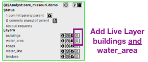

     Add the layer (from the new repository) to QGIS (Live)

Edit a building in the Buildings layer
^^^^^^^^^^^^^^^^^^^^^^^^^^^^^^^^^^^^^^

1. Zoom into downtown St. Louis and find the Lammert Building 
2. Start editing the layer (select the layer in the layer list then press the pencil icon to "Start Editing")

   * You will be given a warning that rendering optimizations will be turned off - press :guilabel:`OK`.

3. Use the "Identify Features" tool to select the Lammert Building
4. Change the "type" to "Office"
5. Stop editing the layer (select the layer in the layer list then press the pencil icon to "Stop Editing")

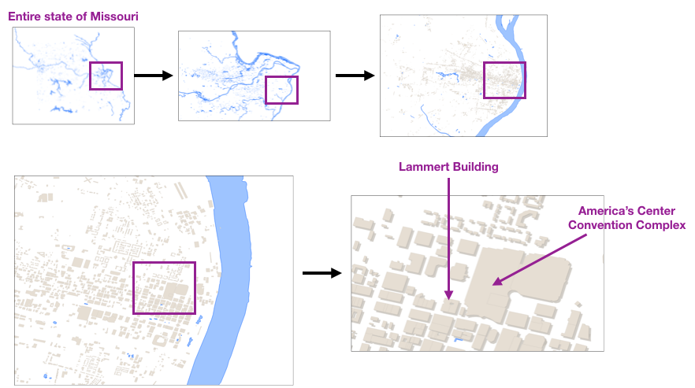

    Locating the Lammert Building in St. Louise

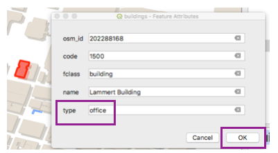

    Change the type to "Office"

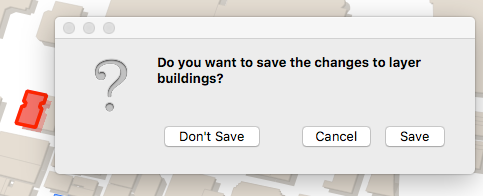

    Stop Editing the layer and "Save" the changes

Commit the change to GeoGig
^^^^^^^^^^^^^^^^^^^^^^^^^^^

After you'ves stopped editing the ``buildings`` layer and saved your changes (QGIS edit buffer), you will be prompted to commit the changes the GeoGig repository.  You can either commit now or commit later (select :guilabel:`Do not commit.  Keep changes in the local edit buffer` to commit later).  

If you commit now, type in a commit message ("change lammert building to 'office'") and press :guilabel:`OK`.  If you choose to commit later, right click on the layer (QGIS's :guilabel:`Layers` panel) and choose :guilabel:`GeoGig --> Commit Local Changes` and type in a commit message ("change lammert building to 'office'") and press :guilabel:`OK`.

If you view the history for the layer, you should see this commit.  To see the history, select the repository ("osm_missouri.demo" in the :guilabel:`Navigator` and select :guilabel:`Show log (diff viewer)...`)

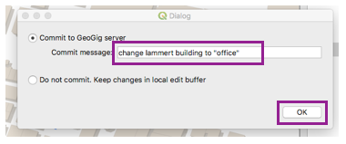

    Stop Editing the layer and "Commit" the changes

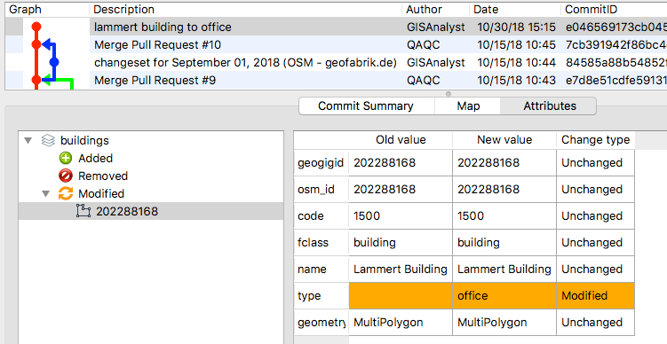

    The change is now in the history for the repository.

Create a Pull Request to move the change to the QA/QC repository
^^^^^^^^^^^^^^^^^^^^^^^^^^^^^^^^^^^^^^^^^^^^^^^^^^^^^^^^^^^^^^^^

1. Open the Constellation View by either:

   * :guilabel:`Navigator`: select the repository ("osm_missouri.demo") and press :guilabel:`Show repo constellation...` 
   * Right-Click on the layer (in the QGIS layers list) and select :menuselection:`GeoGig --> Show Repo Constellation...`

2. Look in our repository (it should be highlighted in red)
3. The :guilabel:`Status` section should say :guilabel:`1 commit ahead of parent` (that's the commit we just made)
4. Press the :guilabel:`Create a PR` button
5. Give a title for the PR and press :guilabel:`Create PR`
6. In the :guilabel:`Constellation Viewer`, the QAQC repository should have a Pull Request

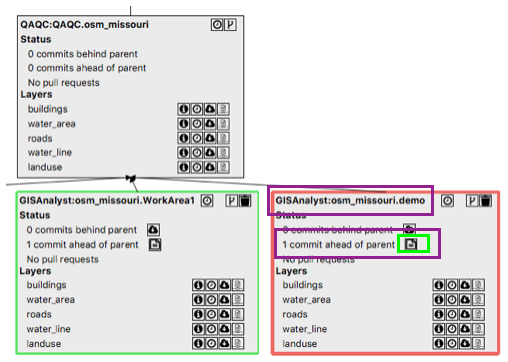

    Our repository - press the button next to "1 commit ahead of parent"

    Creating the Pull Request

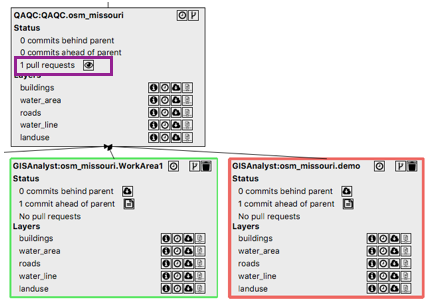

    The QA/QC repository has a Pull Request to evaluate

Accept the Pull Request
^^^^^^^^^^^^^^^^^^^^^^^

1. Logon as the QAQC user

   * Right click on the server in the :guilabel:`Navigator`
   * Select :guilabel:`Change User...`
   * Login as the "QAQC" user (password qaqaqa)

2. Open the constellation viewer

   * In the navigator, select the "QAQC.osm_missouri" repo
   * Right-click and select :guilabel:`Show repo constellation...`

3. Press the :guilabel:`View PRs` button (the eye icon next to "1 pull request")
4. You can press the :guilabel:`Combined Changes` tab to see the single feature changed in this PR (this option is not available for large PRs)
5. If you want you can press :guilabel:`Export Diff` to see the diff representing all the changes in the PR.  A diff layer will be added to the project showing changes - red (delete), green (add), yellow (modified). See `Exporting a Commit Diff <addexplore.html#exporting-a-commit-diff>`_  
6. Go back to the PR (via the :guilabel:`Constellation Viewer`) and press :guilabel:`Merge PR`
7. Open the history for the QAQC layer and you should see your PR changes
8. (Optional) You can now delete the work repository ("osm_missouri.demo") since it is no longer needed

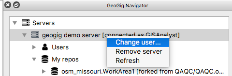

    Change user to QAQC (password qaqaqa)

    The QA/QC repository has a Pull Request to evaluate - press the eye icon

    Reviewing and accepting the PR

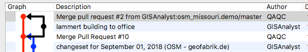

    History of QA/QC repository after merging the PR

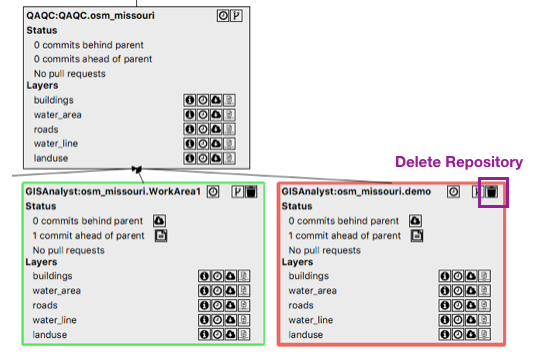

    Optionally - you can delete the work repository ("osm_missouri.demo")
